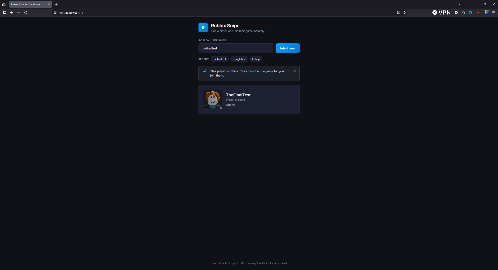

# Roblox Snipe

A companion web app to find a Roblox player and join their game as fast as possible.

## Features

- **Username search** with instant join when the player is in a public game
- **Recent chips** — last 3 searched usernames saved in `localStorage`
- **Player card** — avatar, display name, username, and online/in-game status
- **Clear error states** — user not found, offline, private, joins disabled, rate limited

## Screenshot



## Architecture

```
server/          Express proxy → Roblox public APIs (avoids CORS)
src/api/         Client API layer + presence/join logic
src/components/  UI (input, chips, player card, errors)
src/services/    Search + auto-join orchestration
src/utils/       Roblox deep-link join helpers
```

### Roblox APIs used

| Endpoint | Purpose |
|---|---|
| `POST users.roblox.com/v1/usernames/users` | Username → user ID |
| `POST presence.roblox.com/v1/presence/users` | Online / in-game status + place/instance |
| `GET thumbnails.roblox.com/v1/users/avatar-headshot` | Avatar image |

## Quick start

### 1. Install dependencies

```bash
npm install
```

### 2. Configure environment (optional)

Copy the example env file and adjust values for your machine:

```bash
cp .env.example .env
```

| Variable | Default | Description |
|---|---|---|
| `PORT` | `3001` | Express API proxy port |
| `CORS_ORIGIN` | *(empty)* | Comma-separated allowed origins in production. Leave empty for local dev. |

The app uses Roblox **public** APIs only — no API keys or auth tokens are required.

### 3. Run locally

```bash
npm run dev
```

- Frontend: http://localhost:5173
- API proxy: http://localhost:3001

Both start together via `concurrently`.

## Production build

```bash
npm run build
npm run start:server   # serves API on :3001
npx vite preview       # or deploy `dist/` behind a reverse proxy to `/api`
```

For production:

1. Set `CORS_ORIGIN` to your deployed frontend URL(s).
2. Configure your reverse proxy to forward `/api/*` to the Express server.

## Join behavior

When a player is **In Game** with a public `placeId` and `gameInstanceId`:

1. The app immediately triggers the Roblox Player protocol link
2. After 1.5s, a web fallback tab opens (`roblox.com/games/start`)

Requires Roblox Player installed on desktop for the fastest path.

## Error states

| Code | When |
|---|---|
| `USER_NOT_FOUND` | Username doesn't exist |
| `USER_OFFLINE` | Player is offline or not in a game |
| `USER_PRIVATE` | In-game but location hidden (privacy) |
| `JOINS_DISABLED` | Cannot join (private server / restricted) |
| `RATE_LIMITED` | Roblox API returned 429 |

## License

MIT
